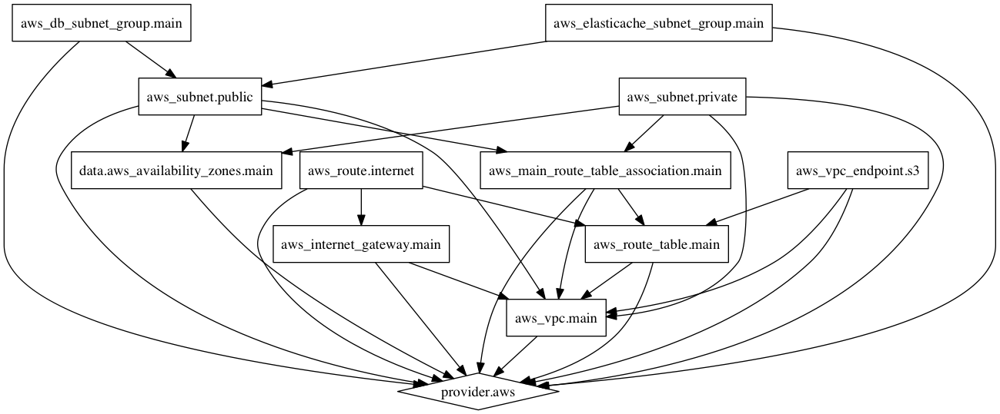

TerraKit.io AWS Network starter
-------------------------------

`aws-starter-network` is a terraform module providing a starter network for your
AWS based infrastructure.  It includes everything you need at a VPC level for
most standard workloads.

The VPC created using this module contains:
- A public subnet in each availability zone, with appropriate route tables
- A private subnet in each availability zone, with appropriate route tables
- Internet Gateway
- Database subnet group
- ElasticCache subnet group
- VPC Endpoint for S3

The number of availability zones is configurable, but we recommend using the
default of 3.  

## Creating Multiple Environments

This module creates a single VPC with all network infrastructure needed for both
public and private resources.  If you need multiple environments, we recommend
have a single VPC per environment.  This ensures that your resources are
physically isolated.  To accomplish this, just include this module once per
environment, giving each environment a different name.

## Terraform Visualization

